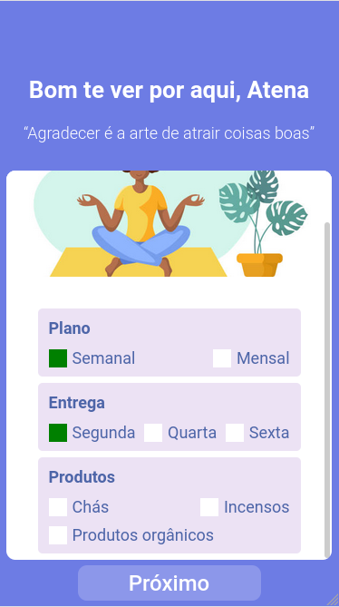

# Gratibox

Welcome to gratibox, a delivery application that aims to deliver healthy products to its customer. Customer can choose which types of products he/she would like to receive and every week or month a new package with random products will be delivered.

## How to run

First, clone git repository into your computer:

    git clone https://github.com/jhonnatangomes/gratibox-front-end

Then, enter the project directory and install dependencies with npm:

    cd gratibox-front-end
    npm i

Now, to start project do:

    npm start

#### Note:

This project depends on a back-end to function properly. In order to download and run its back-end, head over to https://github.com/jhonnatangomes/gratibox-back-end and follow the instructions there.
